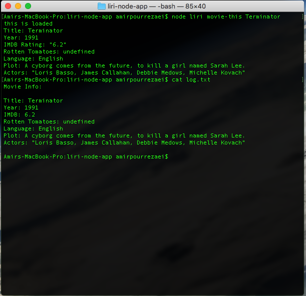
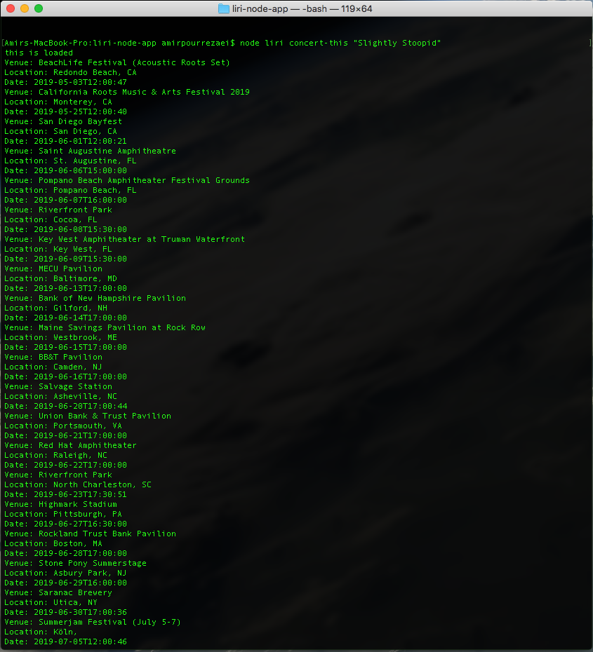
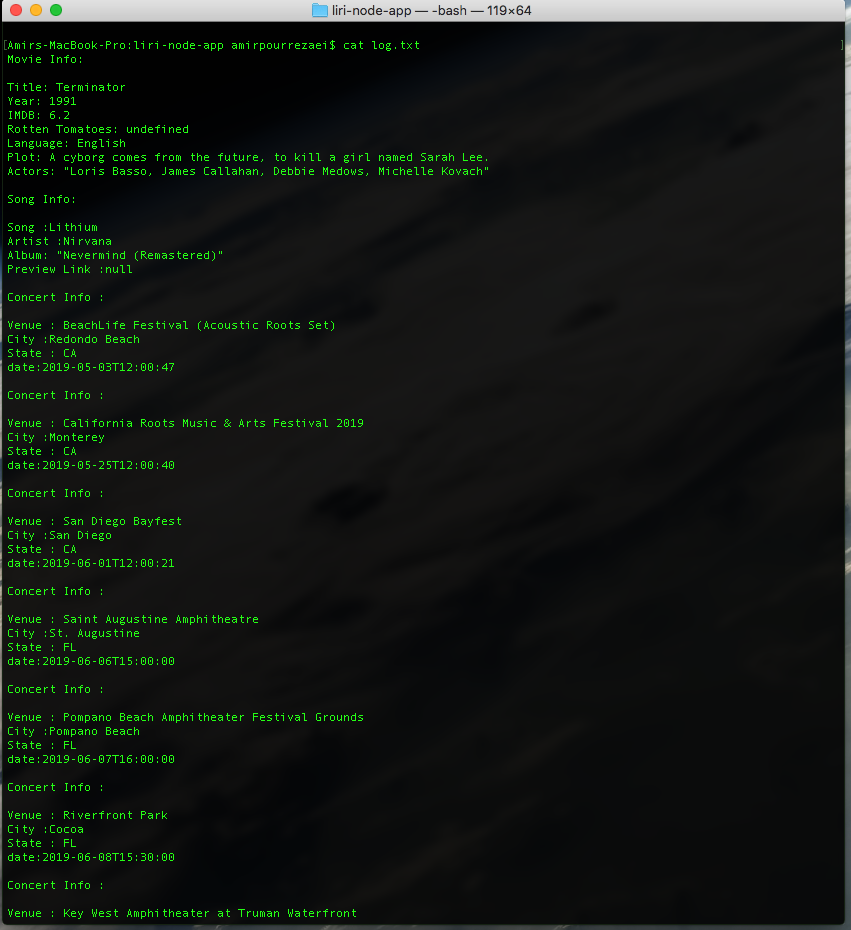
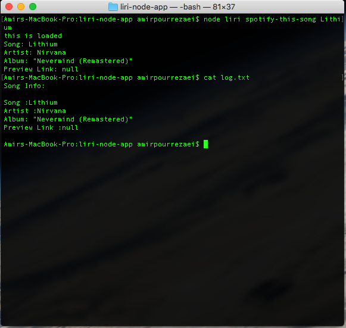

# liri-node-app

## Purpose of App :

* Allows users to query real time databass for information about
    * Songs
    * Movies
    * Concerts
* Logs data to a text file called "log.txt"

## Syntax: #
    * node liri [command] [target]
    * Commands :
        1. [ movie-this ] : Returns and logs information regarding a specific movie
        2. [ concert-this ] : Returns and logs concert information for a specific band
        3. [ spotify-this-song ] : Returns and logs information about a song
## How to use:
    * Movies:
        ex. node liri movie-this "Terminator"
          Returns:

            1. title
            2. year
            3. IMDB Rating
            4. Rotten Tomato Rating
            5. Language
            6. Plot
            7. Actors

    * Concerts:
        ex. node liri concert-this "Slightly Stoopid"
            Returns:

                1. Venue
                2. City
                3. State
                4. Date

    * Song:
        ex. node liri spotify-this-song "Lithium"
            Returns:

                1. Name
                2. Artist
                3. Album
                4. Preview Link      

            
        

    